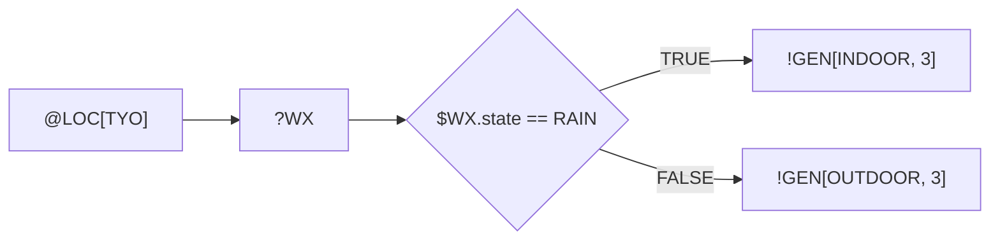

# Zeno Protocol — Grammar Specification v0.1

> **Status:** Stable draft · **Spec version:** 0.1.0 · **Grammar version:** v0.1
> **Machine-readable token table:** [`specs/tokens.json`](./tokens.json)

Zeno is a dense, unambiguous surface syntax for **Agent-to-Agent (A2A)** communication.
It is designed to be:

| Property | Requirement |
| --- | --- |
| **Dense** | ~75 % fewer LLM tokens than the equivalent natural-language prompt. |
| **Unambiguous** | Exactly one parse tree per payload. No context-dependent grammar. |
| **Fast** | Constant-lookahead, single-pass, hand-writable recursive-descent parser. |
| **Round-trippable** | `parse(emit(ast)) == ast` and `emit(parse(src))` is stable. |

---

## 1. Symbol matrix

| Symbol | Token | Role | Example |
| --- | --- | --- | --- |
| `@` | `TARGET` | **Target / Scope** — defines context, entity, location or system target. | `@LOC[AMD]`, `@AGENT[Coder]` |
| `?` | `QUERY` | **Query / Input** — requests information or fetches state. | `?WEATHER`, `?USER_NAME` |
| `!` | `ACTION` | **Action / Output** — executes an action or generates output. | `!GEN[Report]`, `!RUN[Script]` |
| `->` | `ARROW` | **Pipeline / Flow** — passes the output of the left operation to the right. | `@LOC[TYO] -> ?WX` |
| `:` | `COLON` | **Evaluator** — begins a conditional evaluation block. | `: { ... }` |
| `=>` | `THEN` | **Then (Implies)** — action to take when the condition is TRUE. | `$WX == RAIN => !INDOOR` |
| `\|` | `ELSE` | **Else** — action to take when the condition is FALSE. | `!INDOOR \| !OUTDOOR` |
| `$` | `VARIABLE` | **Variable** — references stored latent state. | `$PRICE`, `$TEMP` |

### 1.1 Expression operators

Listed from **lowest** to **highest** precedence.

| Prec. | Operators | Associativity |
| --- | --- | --- |
| 1 | `\|\|` | left |
| 2 | `&&` | left |
| 3 | `==` `!=` `~=` `>` `>=` `<` `<=` | left |
| 4 | `+` `-` | left |
| 5 | `*` `/` `%` | left |
| 6 | `^` | right |
| 7 | `~` (logical not), unary `-` | right |

`~=` is the **match** operator: `$S ~= "error"` is true when the left operand contains the
right operand (substring for text, membership for lists, key-presence for maps).

### 1.2 Truthiness

Used when a condition is not a boolean. `NIL` / `FALSE` / `0` / `0.0` / `""` / `[]` / `{}`
are **falsy**; every other value is **truthy**.

---

## 2. Formal grammar (EBNF)

```ebnf
program         ::= { separation } { statement { separation } } [ statement ] ;

separation      ::= ( NEWLINE | SEMI ) { NEWLINE | SEMI } ;

statement       ::= scope_block
                  | binding
                  | flow ;

(* --- Scope blocks: apply a scope to every inner statement -------------- *)
scope_block     ::= TARGET call_args "{" { separation } { statement separation }
                                          "}" ;

(* --- Bindings: $X = <expr> -------------------------------------------- *)
binding         ::= [ "LET" ] PATH ASSIGN expression ;

(* --- Flows: scope? step (ARROW step)* conditional? --------------------- *)
flow            ::= [ TARGET call_args ] step { ARROW step } [ conditional ] ;

step            ::= call
                  | primary ;

call            ::= ( QUERY | ACTION ) NAME [ call_args ] ;

conditional     ::= COLON [ "{" ] expression "=>" flow [ ELSE flow ] [ "}" ] ;

call_args       ::= "[" [ expression { "," expression } [ "," ] ] "]" ;

(* --- Expressions ------------------------------------------------------- *)
expression      ::= or_expr ;
or_expr         ::= and_expr { "||" and_expr } ;
and_expr        ::= compare_expr { "&&" compare_expr } ;
compare_expr    ::= add_expr { compare_op add_expr } ;
compare_op      ::= "==" | "!=" | "~=" | ">=" | "<=" | ">" | "<" ;
add_expr        ::= mul_expr { ( "+" | "-" ) mul_expr } ;
mul_expr        ::= unary { ( "*" | "/" | "%" ) unary } ;
unary           ::= ( "~" | "-" ) unary | power ;
power           ::= postfix [ "^" unary ] ;
postfix         ::= primary { "." NAME } ;   (* property access; "[]" is reserved for arg lists *)
primary         ::= NUMBER
                  | STRING
                  | "TRUE" | "FALSE"
                  | "NIL" | "NULL" | "NONE"
                  | PATH
                  | call
                  | "[" [ expression { "," expression } ] "]"      (* list literal *)
                  | "(" expression ")" ;

(* --- Terminals --------------------------------------------------------- *)
NEWLINE         ::= U+000A ;
SEMI            ::= ";" ;
ASSIGN          ::= "=" ;              (* not part of "==" or "=>" *)
TARGET          ::= "@" ;
QUERY           ::= "?" ;
ACTION          ::= "!" ;              (* not part of "!=" *)
ARROW           ::= "->" ;
COLON           ::= ":" ;
THEN            ::= "=>" ;
ELSE            ::= "|" ;              (* longest-match wins: "||" lexes as OR *)
NAME            ::= [A-Za-z_][A-Za-z0-9_]* ;
PATH            ::= NAME { "." NAME } ;
NUMBER          ::= "-"? [0-9]+ ( "." [0-9]+ )? ( [eE] [+-]? [0-9]+ )? ;
STRING          ::= '"' { escaped_char | ~["\\] } '"' ;
COMMENT         ::= "#" { ~NEWLINE } | "//" { ~NEWLINE } ;
```

### 2.1 Lexical notes

1. **Maximal munch.** `->`, `=>`, `==`, `!=`, `>=`, `<=`, `~=`, `&&`, `||` are always lexed
   as single tokens. `!` followed by `=` is `!=`; `|` followed by `|` is `||`.
2. **Comments** run to end of line and are discarded before parsing.
3. **Newlines are significant** only as statement separators. Newlines inside `[` … `]`,
   `(` … `)` and `{` … `}` are *soft* — a payload may be pretty-printed across lines
   without changing its meaning.
4. **Case sensitivity.** Sigils, operators and delimiters are case-sensitive. `NAME`
   identifiers are **case-insensitive for atom comparison** (`RAIN == rain` is TRUE) but
   **case-preserving** for storage and echoing.
5. **Optional braces.** A conditional body may be written with braces (`: { c => a | b }`)
   or bare (`: c => a | b`). Both parse to the same AST.

---

## 3. Semantics

### 3.1 Latent state and implicit binding

Every `?QUERY` and `!ACTION` step **implicitly binds** its result to a variable of the same
name, so a later step can reference it as `$NAME`.

```
@LOC[TYO] -> ?WX : { $WX.state == RAIN => ... }
        ^^^^                ^^^
        binds $WX           reads $WX
```

The full path is also bound: `?WX` binds `$WX`; `?USER.PROFILE` binds `$USER.PROFILE`
(property `PROFILE` of `$USER`) as well as the leaf `$PROFILE`.

### 3.2 Pipeline evaluation

`A -> B -> C` evaluates left to right. The **result of the previous step** is available to
the next step as `$PREV` (and as the implicit `_` argument of the step). A leading `@TARGET`
scope is *not* a pipeline step; it is carried as ambient context for every step in the flow.

```
@LOC[TYO] -> ?WX -> !GEN[INDOOR, $WX.count]
   scope     step 1     step 2 receives $WX (the result of step 1)
```

### 3.3 Conditional evaluation

```
: <test> => <then-flow> | <else-flow>
```

* `<test>` is evaluated in the current environment.
* The chosen branch is evaluated **as a flow**, so branches may contain pipelines and
  nested conditionals.
* `|` at the top level of a branch always denotes the else-branch. Use `||` for logical OR.
* If `<test>` is false and no else-branch is given, the flow evaluates to `NIL`.

### 3.4 Execution result framing

The kernel emits a dense result payload using the same grammar:

```
!RET[$WX.state=RAIN,$WX.temp=31,OUT="Museum, Aquarium, Tea house"]
```

`!RET` is the terminal action of every kernel run. Its named arguments become the
`bindings` of the execution result, and `OUT` carries the human-facing payload.

---

## 4. Worked examples

### 4.1 The canonical brief example

```
@LOC[TYO] -> ?WX : { $WX.state == RAIN => !GEN[INDOOR, 3] | !GEN[OUTDOOR, 3] }
```



### 4.2 Arithmetic and bindings

```
$PRICE = 129.99
$QTY = 3
!PRINT[$PRICE * $QTY]
```

### 4.3 Nested flows and scope block

```
@AGENT[Coder] {
  ?REPO -> !RUN[tests]
  $RESULT ~= "failed" => !GEN[Hotfix, 1] | !LOG[green]
}
```

### 4.4 Multi-step research pipeline

```
@AGENT[Researcher] -> ?SEARCH[Zeno Protocol] -> !SUMMARIZE[$PREV, 5]
  : { $PREV.count > 5 => !RANK[$PREV, TOP=5] | !LOG[few_results] }
```

---

## 5. Conformance

An implementation is **Zeno v0.1 conformant** when it:

1. Parses every payload in §4 (and `tests/corpus/` in this repository) to an AST whose
   shape matches the reference AST (ignoring source spans).
2. Rejects the payloads in `tests/invalid/` with a diagnostic code from the table below.
3. Emits canonical source such that `emit(parse(emit(parse(src)))) == emit(parse(src))`.
4. Reports a token count for the canonical example §4.1 of **≤ 25 %** of the token count
   of the equivalent natural-language prompt under a BPE tokenizer.

### 5.1 Diagnostic codes

| Code | Meaning |
| --- | --- |
| `ZN0001` | Lexical error: unexpected character. |
| `ZN0002` | Unterminated string literal. |
| `ZN0003` | Parse error: unexpected token. |
| `ZN0004` | Parse error: unbalanced delimiter. |
| `ZN0005` | Parse error: conditional requires a `=>` branch. |
| `ZN0006` | Parse error: `\|` else-branch used outside a conditional. |
| `ZN1001` | Encode error: model output did not parse after the repair budget was exhausted. |
| `ZN2001` | Runtime error: unresolved query target. |
| `ZN2002` | Runtime error: unknown action. |
| `ZN2003` | Runtime error: undefined variable. |
| `ZN2004` | Runtime error: type mismatch in operator. |
| `ZN2005` | Runtime error: division by zero. |
| `ZN3001` | Provider error: no LLM provider configured or reachable. |
